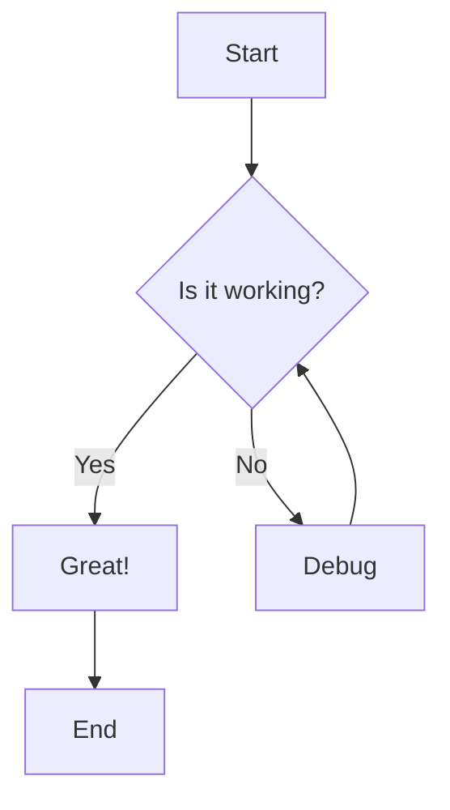
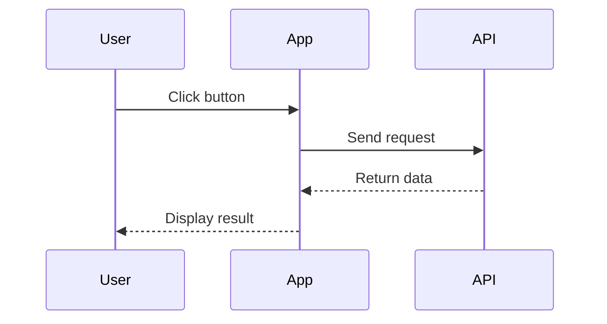
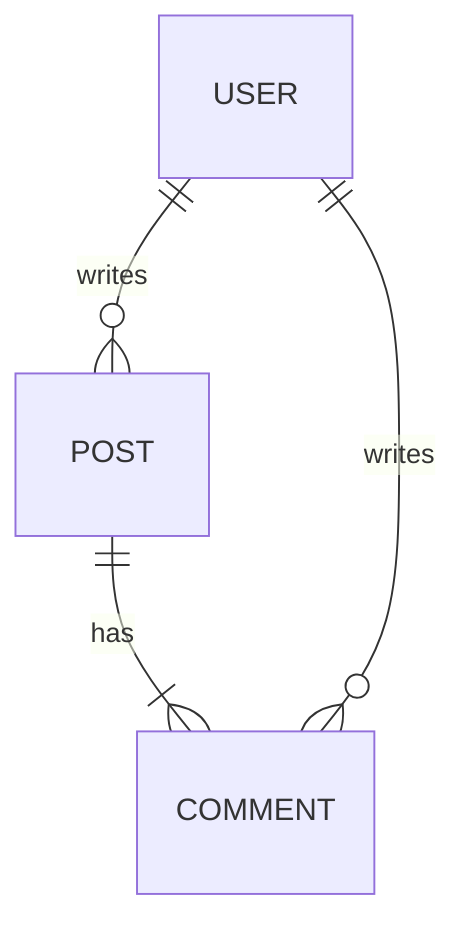

# Markdown Features Showcase

This post demonstrates the various markdown features available for blog posts. Use this as a reference when writing your own content.

## Text Formatting

You can make text **bold**, *italic*, or ***both***. You can also use ~~strikethrough~~ for deleted content.

Here's some `inline code` within a paragraph.

## Links

- [External link to GitHub](https://github.com)
- [Link with title](https://example.com "Example Website")
- Email link: <hello@example.com>

## Images

Here's an example image from the web:


## Blockquotes

> "The best way to predict the future is to invent it."
> — Alan Kay

Nested blockquotes:

> This is the first level of quoting.
>
> > This is a nested blockquote.
>
> Back to the first level.

## Code Blocks

### JavaScript

```javascript
function greet(name) {
  const message = `Hello, ${name}!`;
  console.log(message);
  return message;
}

greet('World');
```

### Python

```python
def fibonacci(n):
    if n <= 1:
        return n
    return fibonacci(n - 1) + fibonacci(n - 2)

# Print first 10 Fibonacci numbers
for i in range(10):
    print(fibonacci(i))
```

### TypeScript with React

```tsx
interface ButtonProps {
  label: string;
  onClick: () => void;
  variant?: 'primary' | 'secondary';
}

const Button = ({ label, onClick, variant = 'primary' }: ButtonProps) => {
  return (
    <button 
      className={`btn btn-${variant}`}
      onClick={onClick}
    >
      {label}
    </button>
  );
};
```

### Shell Commands

```bash
# Install dependencies
npm install

# Start development server
npm run dev

# Build for production
npm run build
```

## Lists

### Unordered List

- First item
- Second item
  - Nested item 1
  - Nested item 2
    - Deep nested item
- Third item

### Ordered List

1. First step
2. Second step
   1. Sub-step A
   2. Sub-step B
3. Third step

### Task List

- [x] Complete project setup
- [x] Write documentation
- [ ] Add unit tests
- [ ] Deploy to production

## Tables

| Feature | Status | Priority |
|---------|--------|----------|
| Authentication | ✅ Done | High |
| Dashboard | 🚧 In Progress | High |
| Settings | 📋 Planned | Medium |
| Analytics | 📋 Planned | Low |

### Aligned Table

| Left Aligned | Center Aligned | Right Aligned |
|:-------------|:--------------:|--------------:|
| Cell 1 | Cell 2 | Cell 3 |
| Cell 4 | Cell 5 | Cell 6 |

## Horizontal Rule

Content above the line.

---

Content below the line.

## Definition-style Content

**Term 1**
: This is the definition of term 1.

**Term 2**
: This is the definition of term 2.

## Footnote-style Citations

Here's a statement that needs a citation[^1].

Another referenced claim[^2].

[^1]: This is the first footnote reference.
[^2]: This is the second footnote with more detail.

## Math and Technical Notation

Inline math: The equation `E = mc²` is famous.

For algorithms, Big O notation like `O(n log n)` is common.

## Emoji Support

🚀 Rocket launch! 
✨ Sparkles for emphasis
🎉 Celebration time
💡 Great idea
⚠️ Warning message

## Mermaid Diagrams

You can create diagrams using Mermaid syntax:

### Flowchart



### Sequence Diagram



### Entity Relationship



## Summary

This post covers:
- Text formatting (bold, italic, strikethrough)
- Links and images
- Blockquotes
- Code blocks with syntax highlighting
- Lists (ordered, unordered, task lists)
- Tables with alignment
- Horizontal rules
- Mermaid diagrams
- And more!

Feel free to use this as a template for your own blog posts.
